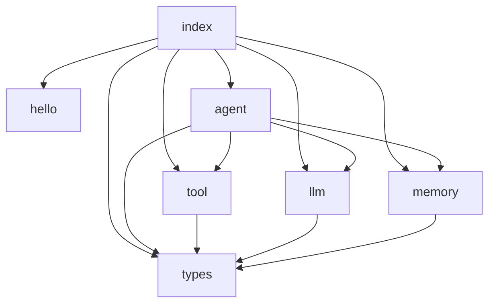

# src 核心模块清单

## 概述

`src/` 目录是 yu-agent 的核心源码模块，按照功能划分为以下子模块：

```
src/
├── index.ts          # 模块入口，导出所有公共 API
├── hello.ts          # 原始入口文件（保留兼容）
├── MODULE_MAP.md     # 本文件：模块清单与依赖关系
├── types/
│   └── index.ts      # 核心类型定义
├── agent/
│   └── index.ts      # Agent 生命周期管理
├── tool/
│   └── index.ts      # 工具注册与执行
├── llm/
│   └── index.ts      # LLM 调用与提供商管理
└── memory/
    └── index.ts      # 记忆存储与管理
```

## 模块清单

| 模块 | 路径 | 职责 | 核心导出 |
|------|------|------|----------|
| **types** | `src/types/index.ts` | 核心类型定义 | `LLMConfig`, `ToolDefinition`, `AgentConfig`, `MemoryItem`, `AgentResult` |
| **agent** | `src/agent/index.ts` | Agent 生命周期管理 | `Agent` 类, `createAgent()` 工厂函数 |
| **tool** | `src/tool/index.ts` | 工具注册与执行 | `ToolRegistry` 类, `globalToolRegistry` 单例 |
| **llm** | `src/llm/index.ts` | LLM 调用与提供商管理 | `LLMManager` 类, `LLMProvider` 接口, `globalLLMManager` 单例 |
| **memory** | `src/memory/index.ts` | 记忆存储与管理 | `MemoryManager` 类, `MemoryStore` 接口, `InMemoryStore` 实现 |

## 模块依赖关系



### 依赖说明

1. **types** — 基础类型模块，被所有其他模块依赖（无外部依赖）
2. **agent** — 核心模块，依赖 types、llm、tool、memory 完成 Agent 执行循环
3. **tool** — 工具模块，依赖 types 定义工具接口
4. **llm** — LLM 模块，依赖 types 定义消息格式和配置
5. **memory** — 记忆模块，依赖 types 定义记忆条目格式

## 与 extension 模块的关系

`src/` 是核心抽象层，`extension/` 是具体实现层：

| src 模块 | extension 对应实现 |
|----------|-------------------|
| `src/agent/` | `extension/agent-loop.ts` — Agent 执行循环的具体实现 |
| `src/tool/` | `extension/tools/registry.ts` — 工具注册表的具体实现 |
| `src/llm/` | `extension/deepseek.ts`, `extension/provider.ts` — LLM 提供商实现 |
| `src/memory/` | `extension/session-context.ts`, `extension/db.ts` — 持久化存储 |
| `src/types/` | `extension/types.ts` — 扩展类型定义 |

## 后续扩展方向

- [ ] 添加 `src/planner/` — 任务规划模块
- [ ] 添加 `src/embedding/` — 向量嵌入模块
- [ ] 添加 `src/retrieval/` — 知识检索模块
- [ ] 添加 `src/error/` — 错误处理与重试模块
- [ ] 添加 `src/telemetry/` — 遥测与日志模块
